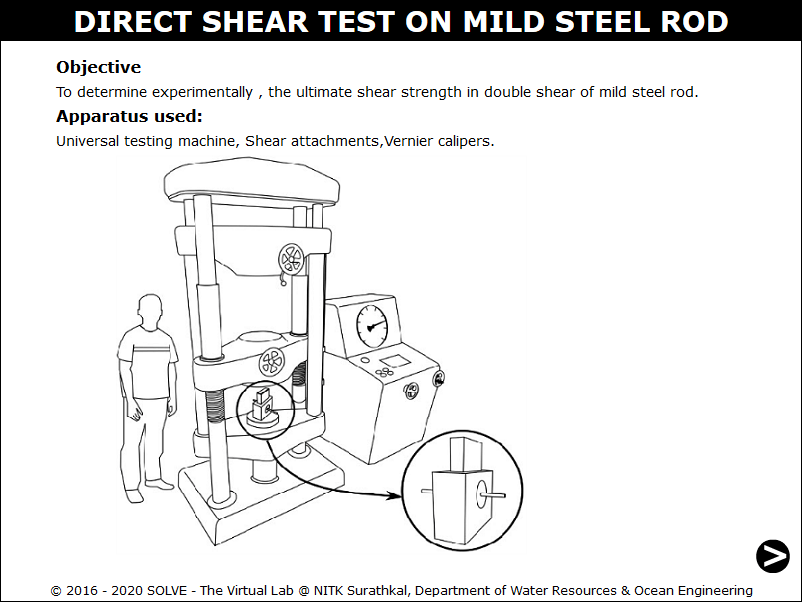
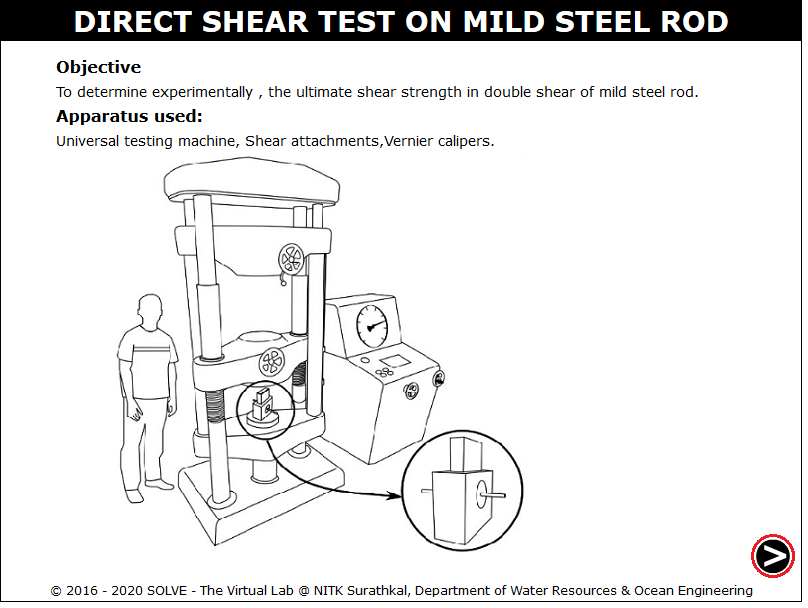
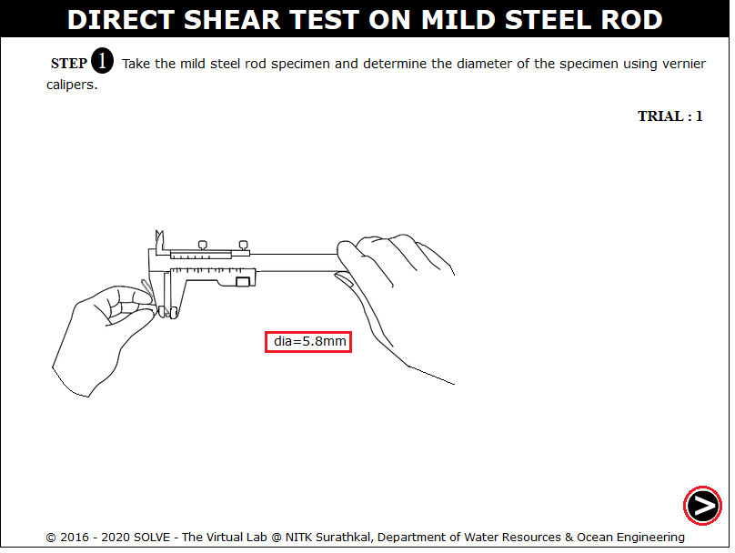
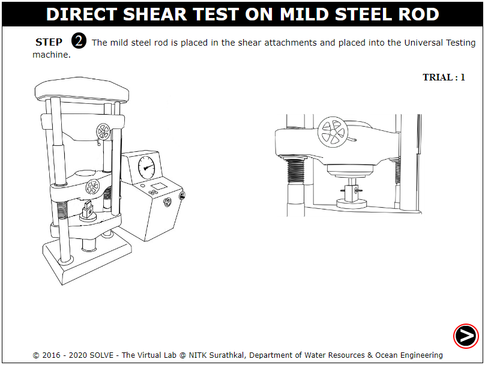
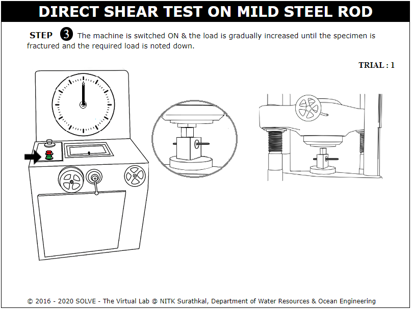
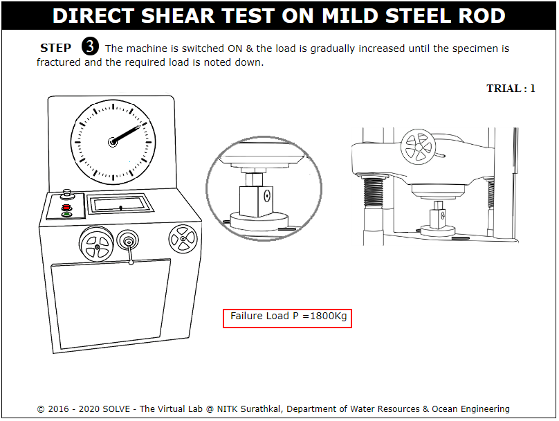
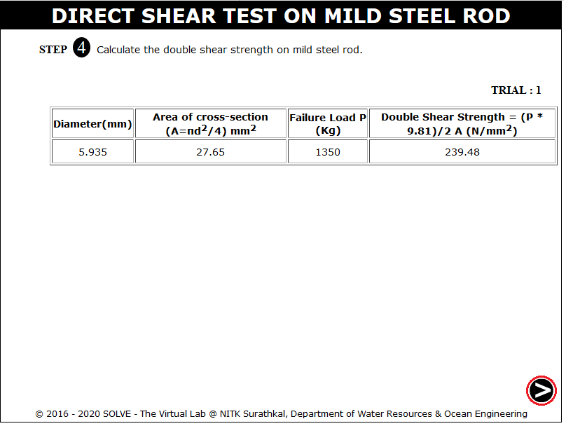
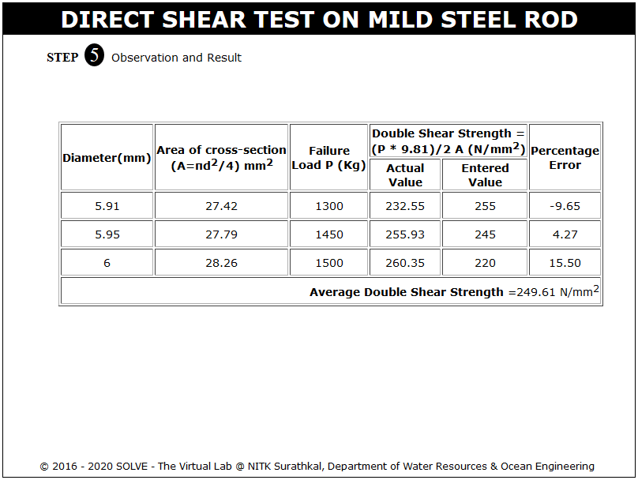

**OBJECTIVE**:

To determine experimentally, the ultimate shear strength in double shear of mild steel rod.

**STEPS**:

1. Click on the direct shear test on mild steel rod file, a window will open as shown below.  
   

2. Click on the next button to continue the experiment.  
   

3. Now the diameter of the mild steel rod is determined using a vernier scale, and then click on NEXT button.  
   

4. Here the shear attachment is placed in UTM, and after that move to the next step by clicking on NEXT button.  
   

5. Now the machine is switched on and the load is applied gradually.  
   

6. After failure of the specimen failure load is determined and the machine is switched off by clicking on the red button and then click on the NEXT button to check the results.  
   

7. The results for the first trial are obtained as following.  
   

8. Same steps are repeated for further trials.  
   
