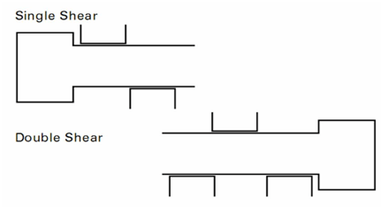
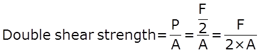
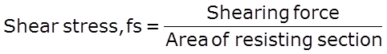
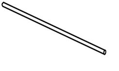

In direct shear test, the shearing stress is considered as uniformly distributed over the entire cross section. The shear force is applied by a suitable test rig, two different cases of shearing may arise; i.e., single shear and double shear. In single shear shearing occurs across a single surface and in double shear shearing occurs across two surfaces. Knowledge of shear failure is important while designing any structures or machine components. Shear force causes the surface to go out of the alignment with each other and thus the material fails.

The shearing force P in each section is P = F/2, it can be concluded that the average shearing stress is the maximum load divided by the combined cross-sectional area of the two planes This shall be calculated from the following formula:

Shear strength of the specimen is determined by inserting a cylindrical specimen through round holes in three hardened steel blocks, the centre of which shall be pulled (or pushed) between the other two so as to shear the specimen on two planes. In this test a suitable length of cylindrical specimen is subjected to double shear loading using a suitable test rig in a testing machine under a compressive load or tensile pull and recording the maximum load P to fracture. The speed of testing or the rate of separation of the cross-heads, at any moment during the test, shall not be greater than 10 mm/min.

**Shear stress**:

It is produced in a body when it is subjected to two equal and opposite forces spaced at an infinite decimal distance or tangentially across the resisting section.

Generally it is difficult to produce conditions of pure shear as some bending effect is likely to occur due to shearing load resulting in equal and opposite forces at a small finite distance.

**TEST SPECIMEN**:

Specimen shall normally be of full cross section for cylindrical metallic products up to and including 25 mm in diameter,in the case of cylindrical products over 25 mm in diameter the samples may be turned down to a specimen of 25 mm diameter for testing.According to the indian standard minimum length of the specimen should be twice the diameter, the maximum length of the specimen is not specified as it has no particular effect on the test result. Shear strengths of typical metals are of the order of about 60-80% of their ultimate strengths in tension. For example, the shearing strength of a 60 ksi steel (yield strength = 60 ksi, ultimate strength about 70~75 ksi) is around 50~60 ksi.

**RELEVANT INDIAN STANDARD FOR DIRECT SHEAR TEST**:

1. IS 5242-1979: Method of test for determining shear strength of metals.
